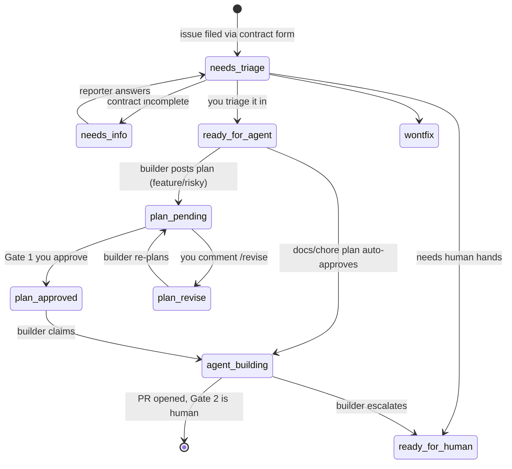

# Architecture

The system turns a GitHub issue into a merged PR through a pipeline with two human gates. An agent does the labor. You keep the judgment calls: which plans proceed, and which releases ship.

## The pipeline

1. **A change enters as a contract.** The issue form (`change_request.yml`) requires a summary, acceptance criteria, constraints, out-of-scope list, rollback considerations, and a risk tier. A vague contract produces a plausible plan for the wrong problem, so the form refuses vagueness up front.
2. **Automation applies the risk label.** `apply-risk-label.yml` parses the risk dropdown and applies one of four `risk:*` labels. The tier drives plan depth and whether the builder stops for approval.
3. **The builder plans.** `/build-next` claims the oldest `ready-for-agent` issue and writes a plan scaled to risk. Docs and chore work auto-approves. Feature and risky work stops at **Gate 1**: the plan waits as `plan:pending` until you approve it or request changes with a `/revise` comment.
4. **The builder builds.** On `plan:approved`, it works in an isolated worktree, on its own branch, test-first, to the standard defined in `coding-standards.md`. It runs every command in `config.verifyCommands` and opens a PR. It never merges.
5. **Review and CI gate the PR.** The reviewer workflow and your required checks run. **Gate 2** is release approval: you merge when the work is verified and the rollback path is real. No rollback path means no approval.
6. **The night shift keeps the queue clean.** Nightly, `/triage-prs` reproduces failing checks on the fleet's own PRs, fixes mechanical failures as fix PRs, escalates judgment calls, and files a self-audit report. It never merges either.

Labels are the durable state. Every scheduled wake-up reads them cheaply and exits without spending a Claude token when there is no work.

## The label state machine

The `risk:*` labels ride alongside this lifecycle, and two kill-switch labels sit outside it: `builder:paused` and `triage:paused` stop their loops with no code change and no shell access.

## The two safety invariants

The night shift's broad auto-fix mandate is safe because both of these hold:

1. **Verify before submit.** A fix that does not make the failing check pass locally is reverted and escalated. A plausible-but-wrong fix never leaves the machine.
2. **Fixes re-enter the gate.** Every fix is a PR facing the same review and CI as daytime work. Nothing reaches a branch without gate sign-off.

The builder's version of the same idea is the hard-limits block in `/build-next`: never merge, never push to the default branch, never touch workflows, deploy config, or `protectedPaths`.

## Where each piece runs

| Piece | Runs | Trigger |
|---|---|---|
| Risk labeling | GitHub Actions | issue opened or edited |
| `@claude` responder, PR reviewer | GitHub Actions | mentions, PR events |
| Builder | your machine (launchd/cron), or the hosted variant | schedule or pipeline labels |
| Night shift | your machine (launchd/cron) | nightly schedule |

The local drivers are the battle-tested path. Their pre-checks make idle wake-ups free, and your machine already has your credentials, your toolchain, and your worktrees. The hosted variant (`actions-builder.yml`) trades that control for zero infrastructure.
