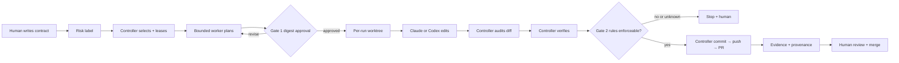
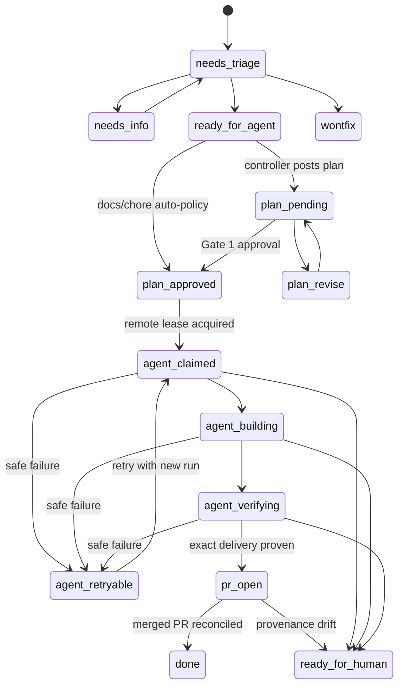

# Architecture

Version 3 is a deterministic control plane around bounded AI workers. GitHub carries the contract and durable lifecycle. Git refs provide the cross-runner lease. The controller owns policy and delivery. Harnesses only plan or edit inside a disposable worktree.

## Authority map

| Layer | Owns | Must never own |
|---|---|---|
| Human + GitHub | contract, Gate 1 approval, CI, Gate 2 merge | model execution policy |
| Controller | selection, lease, digests, worktree, policy, verification, Git/PR/labels, evidence | product judgment |
| Harness adapter | invoke provider, normalize strict `AgentResult` | GitHub token, Git delivery, authoritative outcome |
| Claude/Codex worker | plan text or ordinary file edits | labels, branch, commit, push, PR, proof |

This split is the main safety boundary. Provider output is a proposal. Success is derived from controller observations: real diffs, command exits, remote SHAs, GitHub PR fields, and label postconditions.

## End-to-end flow

## Lifecycle

Every issue must carry exactly one lifecycle label. Risk and pause labels are orthogonal metadata.

Labels make state visible and schedulable, but a label alone is not a lock. The controller acquires `refs/heads/<prefix>/leases/issue-N` with a unique lease commit. The first non-force push wins. Expiry takeover uses `--force-with-lease` against the observed old SHA, and release is a compare-and-swap delete. A stale worker cannot silently replace a newer lease.

## Bound work

Planning produces a canonical `WorkContract` digest and a `planDigest`. Approval records both. Building re-reads the issue and rejects approval if contract bytes changed. The `WorkOrder` also binds repository identity, issue number, base SHA, run ID, worktree, allowed paths, protected paths, verification commands, and lease fence.

The adapter receives that bounded order and returns one strict `AgentResult`. Unknown fields are rejected. A worker cannot add `openedPr`, claim a label transition, or author controller identifiers. Missing usage remains unknown instead of becoming zero.

## Split-privilege delivery

Claude is invoked with Read/Edit/Write/Glob/Grep only. Codex runs with `workspace-write`, no network, no approval prompts, and no GitHub environment credentials. Both are told not to run Git, but policy does not depend on that instruction: the controller checks that branch and HEAD are unchanged, enumerates the real diff, rejects protected paths and unsafe file modes, and independently runs verification.

Only after those checks—and a second pause check—does the controller verify Gate 2 branch protection, commit, push a new remote branch, open the PR, and query GitHub to confirm exact head branch, head SHA, and base branch. Any mismatch fails closed.

## Evidence and recovery

Each run has a private directory outside the repository containing the work order, bounded prompt, raw provider events, normalized result, verification artifacts, and a hash-chained evidence stream. Successful delivery adds a provenance record keyed by PR number with exact repository, branch, and head SHA.

`reconcile` is read-only by default. With `--apply`, it CAS-deletes expired leases, moves stranded active work to `agent:retryable`, marks exactly matched merged deliveries `done`, and moves provenance drift to `ready-for-human`. It never reconstructs success from model prose.

## Night shift

The old night shift handed a model Git/GitHub tools to repair failing PRs. Version 3 removes that authority. `triage` now performs deterministic diagnosis only: it selects same-repository PRs with failing checks and reports them only when repository, PR number, branch, and head SHA match controller evidence. An operator then chooses whether to retry through the normal contract or take the work by hand.

## Gate 2 limitations

`doctor` reads classic branch protection and requires PR reviews, admin enforcement, no force-push/deletion, and every configured required check. GitHub rulesets, bypass actors, enterprise variants, and effective permissions can be more complex than one endpoint exposes. Therefore `doctor=READY` is necessary, not sufficient: release requires a live sandbox proof using the exact automation identity.

## Trust zones

Untrusted issue text and repository content cross into the worker. Maintainer labels and approval markers cross into the controller. GitHub credentials exist only in the controller process. Because a local worker still runs under the same OS account, strong isolation requires a container or disposable VM; tool flags are capability reduction, not a kernel boundary.
